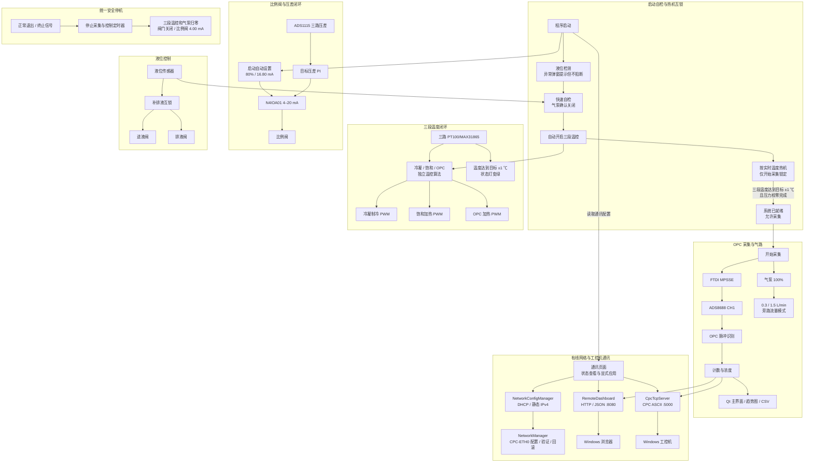

# CPC 凝结核粒子计数器主控平台

`CPC` 是运行在 Raspberry Pi 5 上的凝结核粒子计数器（Condensation Particle Counter）整机控制程序。项目使用 Qt 5/C++ 构建图形界面，将 OPC 原始信号采集与计数速率标定、三段温度监测与控制、气泵和比例阀控制、三路压差测量、液位自动补液、手动排液、有线网络与工控机通讯及整机安全关机集中在一个全屏操作平台中。

> 本仓库面向实际硬件。编译成功只能证明软件可以构建，不能替代接线、电平、流量、温度和阀门动作的实机验证。首次运行前请先确认执行器默认状态安全。

## 主要功能

- 通过 FTDI D2XX + ADS8688 采集 OPC 模拟脉冲信号。
- 对 OPC 信号进行动态阈值、脉冲分段、相邻峰拆分和重叠修正，计算颗粒计数速率并进行二次标定。
- 每累计满约 1 秒更新一次主界面颗粒数目浓度趋势，同时显示 OPC 原始波形，并可将原始数据保存为 CSV。
- 提供独立通讯页面，可查看有线网卡状态、配置 DHCP/静态 IPv4，并管理 Web 与 TCP 服务。
- 内置只读 Web 看板，可通过网线在 Windows 浏览器中实时查看颗粒浓度和最近 10 分钟趋势。
- 内置 CPC TCP Protocol V1.0 服务，每秒向 Windows 工控机发送颗粒浓度和状态帧。
- 使用三只 PT100/MAX31865 监测冷凝段、饱和段和 OPC 段温度。
- 使用硬件 PWM 控制冷凝段制冷片和饱和段加热棒，并提供预测式温控逻辑。
- 使用 ADS1115 轮询三路压差传感器，支持启动校零、滤波、量程检查和接反提示。
- 通过 N4IOA01 4–20 mA 模块手动控制比例阀，或以指定压差通道进行 PI 闭环控制。
- 使用 GPIO PWM 控制气泵。
- 使用原整机风扇接口控制旁路电磁阀，手动选择 1.5 L/min 或 0.3 L/min 工况。
- 自动监测液位、缺液补液、补液超时锁定，并支持按住按钮手动排液。
- 程序退出或整机关机前执行统一的执行器安全关闭流程。

## 系统组成与数据流



## 界面页面

程序使用 1280×720 全屏无边框界面，共包含七个页面：

| 页面 | 主要内容 |
| --- | --- |
| 总览 | 颗粒数浓度、浓度趋势、温度状态灯、液位状态、气泵/流量/压差摘要、采集启停和原始数据保存 |
| 温控 | 三段目标温度、温控启停、实时温度和 PWM 功率 |
| 气路 | 气泵功率、0.3/1.5 L/min 流量模式、比例阀手动开度、4–20 mA 输出读取/关闭、压差闭环设置、三路 ADS1115 压差监测与重新校零 |
| 液位 | 液位状态、自动补液运行记录和“按住排液”控制 |
| 算法 | OPC 动态阈值设置，以及基于原始计数速率（个/s）的 `a·x²+b·x+c` 二次标定参数 |
| OPC | 空气入口 → 饱和段 → 冷凝段 → OPC 光腔流程提示和最近 50 ms 原始波形 |
| 通讯 | 有线网卡状态、DHCP/静态 IPv4 设置、Web/TCP 服务开关与端口，以及客户端和发送状态 |

所有数值参数采用触控输入：点击数值框会打开大尺寸数字键盘，可直接输入并确认；界面不再依赖微小的上下调节箭头，滚轮也不会误改参数。

## 硬件接口

### GPIO 与 PWM

引脚号均为 BCM 编号；物理针脚按 Raspberry Pi 40 Pin 排针标注。

| BCM GPIO | 物理针脚 | 功能 | 控制方式 | 有效状态/默认状态 |
| ---: | ---: | --- | --- | --- |
| GPIO12 | 32 | 冷凝段制冷片 | RP1 PWM0 channel 0，5 Hz | 占空比 0–100%；启动和退出时为 0% |
| GPIO13 | 33 | 饱和段两根加热棒（共用） | RP1 PWM0 channel 1，5 Hz | 占空比 0–100%；启动和退出时为 0% |
| GPIO23 | 16 | 气泵 | `lgpio` PWM，200 Hz | 占空比 0–100%；退出时为 0% |
| GPIO27 | 13 | 液位传感器 | 数字输入，内部下拉 | 高电平=有液/正常，低电平=缺液 |
| GPIO22 | 15 | 进液电磁阀 | 数字输出 | 高电平打开，低电平关闭；默认关闭 |
| GPIO6 | 31 | 排液电磁阀 | 数字输出 | 高电平打开，低电平关闭；默认关闭 |
| GPIO24 | 18 | 旁路电磁阀 | 数字输出 | 高电平打开=1.5 L/min；低电平关闭=0.3 L/min，默认为小流量 |
| GPIO25 | 22 | OPC 段单根 30 W 加热棒 | `lgpio` PWM，5 Hz | 低超调闭环占空比 0–50%；启动和退出时为 0% |

项目当前配置 `GPIO_CHIP=4`、`HARDWARE_PWM_CHIP=0`，对应已检查过的 Raspberry Pi 5 RP1 GPIO/PWM 布局。更换板卡或系统内核后，应先重新确认 `/dev/gpiochip*` 和 `/sys/class/pwm/pwmchip*`，不要只根据界面功率值判断引脚已有输出。

### 温度采集

三路 PT100 通过独立的 SPI/MAX31865 接口读取：

| 温区 | SPI 设备 | 软件校准 |
| --- | --- | --- |
| 冷凝段 | `/dev/spidev1.0` | offset `-5.0`，gain `0.94866653`，bias `-2.88653625` |
| 饱和段 | `/dev/spidev1.1` | offset `-8.0`，gain `0.95384681`，bias `0.17535515` |
| OPC 段 | `/dev/spidev1.2` | offset `0.0`，gain `0.99875547`，bias `-9.19239152` |

- PT100 标称电阻为 100 Ω，参考电阻为 430 Ω。
- 界面每 500 ms 读取温度并更新状态。
- 冷凝段默认目标为 10 ℃，使用预测式制冷控制。
- 饱和段默认目标为 40 ℃，使用预测式加热控制。
- OPC 段默认目标为 40 ℃，单根 30 W 加热棒使用独立的低超调预测控制：最大输出 50%（约 15 W），接近目标后最高 20%（约 6 W），按 90 秒升温趋势提前断热。温度超过目标 5 ℃时锁停，待温度下降后需手动重启。
- OPC 段 PT100 读数无效、超出 -50～150 ℃ 或 GPIO PWM 写入失败时立即关闭加热，恢复后需要手动重新启动温控。
- 总览页以“目标温度 ±1 ℃”作为绿色状态灯判据。

### OPC 原始信号采集

- 程序启动时先检测液位；发现缺液或液位控制不可用会弹窗提示，但不会阻止后续自检和热机。快速安全自检仅在气泵无法确认关闭时阻止热机；PT100、温控 PWM、压差、比例阀、旁路和 FTDI 的异常在各自界面显示或使用时处理，不再让启动自检长期等待。
- 顶部三个温控状态灯仅在对应温控已开启、温度读数有效且当前温度达到目标温度 `±1.0 ℃` 时变绿，其余状态保持红色。
- 自检通过后自动开启冷凝段、饱和段和 OPC 段闭环温控，主界面顶部状态栏实时显示“热机中”或“已就绪”，不再使用固定 10 分钟倒计时。三段温控均已开启且有效温度达到各自目标值 `±1.0 ℃`、压力校零完成并且气泵接口正常后，系统进入就绪状态并解锁“开始采集”。
- 热机期间仅“开始采集”受系统就绪条件限制；温控、气泵、排液、阀门等功能均可手动操作，同时继续遵守设备可用性和压力校零等安全限制。气泵默认功率设定为 `100%`，程序启动时保持关闭；每次从主界面开始采集时，程序先确认气泵以 100% 功率运行。
- 采集链路：FTDI D2XX/MPSSE → ADS8688。
- 默认打开 FTDI `DEVICE_INDEX=0`，MPSSE 时钟配置为 15 MHz。
- ADS8688 使用 CH1、0–10.24 V 量程，每个数据块包含 4000 个采样点。
- 原始缓存最多保留约 2,000,000 点（代码注释对应约 10 秒、200 kSPS），超出后批量移除旧数据，避免长期运行耗尽内存。
- OPC 页面只绘制最近 50 ms 的抽样波形，降低界面绘图负担。
- “保存数据”输出 `Time(s),Voltage(V)` 两列 CSV。

### OPC 计数速率与标定显示

`algorithms/OpcCounter.*` 负责：

- 根据滑动窗口内的本底分位数和噪声范围生成动态阈值。
- 连接很短的阈值下间隙，过滤过窄的脉冲段。
- 在一个脉冲段内根据峰距和谷深拆分相邻粒子。
- 可选按脉宽对重叠脉冲进行额外计数修正。
- 累计至少 1 秒的完整数据块，以“累计颗粒数 ÷ 实际累计时长”计算原始颗粒计数速率 `x`，单位为 `个/s`。
- 使用算法页保存的二次函数 `y = a·x² + b·x + c` 标定计数速率；默认 `a=0、b=1、c=0`。

每次一秒窗口结算后，先应用二次标定，再进行指数平滑：本次值权重为 `0.65`，上次显示值权重为 `0.35`。底层数值的实际计算基础仍是颗粒计数速率 `个/s`；按界面约定，主界面数值和趋势图的单位文字显示为 `个/ml`，但未引入实际流量换算。

旁路模式仍用于控制实际气路工况，但不再参与颗粒数值计算：

- 旁路阀开启：`1500 ml/min`，大流量模式。
- 旁路阀关闭：`300 ml/min`，小流量模式。

### 三路压差采集

- 设备：ADS1115，`/dev/i2c-1`，地址 `0x48`。
- 模式：单次转换、PGA ±4.096 V、128 SPS，按 A0 → A1 → A2 顺序轮询。
- 软件读取配置寄存器的 OS 完成位，转换未完成时每 1 ms 复查，最长等待 50 ms。
- 三路传感器均按 0–5 V 输出、`10 kΩ / 18 kΩ` 分压接入 ADS1115，软件恢复传感器侧电压。

| ADS1115 通道 | 传感器量程 | 换算系数 | 界面单位 |
| --- | ---: | ---: | --- |
| A0 | 0–40 kPa | 8000 Pa/V | kPa |
| A1 | 0–500 Pa | 100 Pa/V | Pa |
| A2 | 0–300 Pa | 60 Pa/V | Pa |

程序启动后自动执行 3 秒零点校准。校准期间气泵启动按钮被禁用，三只传感器的 H/L 两侧必须保持等压。每一路独立使用 9 点中值滤波和系数 `0.20` 的指数平滑；ADC 接近 3.3 V、传感器电压超过 5 V、压力超量程或明显负压时，界面会给出提示。

### 比例阀与目标压差闭环

- 比例阀模块：N4IOA01，串口 `/dev/ttyAMA0`，`9600-8N1`，模块地址 `0x01`。
- 通道 1 电流寄存器：`0x0000`，寄存器单位为 0.01 mA。
- 默认手动开度为 `80%`（对应 `16.80 mA`），程序启动后会自动写入 N4IOA01，设置结果显示在气路页；开度映射为 `0%=4.00 mA`、`50%=12.00 mA`、`100%=20.00 mA`。
- 软件使用实测标定点进行分段插值，补偿模块设定值与实际电流之间的误差。
- 手动模式支持设置开度、读取当前输出和写入 4.00 mA 安全关闭。

目标压差闭环由 `PressureValveController` 实现：

- 可选择 A0、A1 或 A2 作为反馈通道。
- 默认参数为 `Kp=0.40`、`Ki=0.08 1/s`。
- 误差按所选传感器满量程归一化，默认死区为满量程的 0.2%，单次开度变化限制为 5%。
- 必须按实际气路选择“开度增大时压差增大”或“开度增大时压差减小”。
- 启动闭环前必须先启动气泵，并确保所选压差通道具有新鲜、无报警的数据。
- 闭环运行时锁定手动设置，但“安全关闭”始终可用。
- 反馈超过 1.5 秒未更新、传感器报警/通信失败、比例阀通信失败、气泵停止或用户停止闭环时，程序停止闭环并尝试输出 4.00 mA。

### 液位、自动补液与排液

液位监控在程序启动后自动开启，每 500 ms 读取一次 GPIO27：

- 连续两次读取到低电平后才确认缺液，避免单次毛刺触发补液。
- 自动补液前先关闭 GPIO6 排液阀，确认写入成功后再将 GPIO22 置高打开进液阀。
- 液位恢复高电平后立即关闭进液阀。
- 单次补液最长 10 秒；超时后关闭并锁定进液阀，防止 500 ms 监控循环反复重新打开。
- 液位恢复正常或重新启动监控后解除超时锁定。
- 传感器读取、GPIO 初始化或阀门写入失败时走安全关闭路径并显示报警。
- 同一次连续异常只弹出一次液位报警；恢复正常后，下一次异常可以再次弹窗。详细事件持续写入液位页日志。
- “按住排液”期间先停止补液、关闭进液阀，再打开排液阀；松开按钮即关闭排液阀。

## 安全行为

程序初始化数字输出时默认写低电平。正常退出、点击右上角关机按钮，或收到
`SIGINT`、`SIGTERM`、`SIGHUP`、`SIGQUIT` 时，都会在事件循环退出前执行统一安全停机：

1. 先停止采集、温控和压差闭环定时器，防止停机过程中重新写入执行器。
2. 将冷凝段与饱和段占空比置零、禁用硬件 PWM，并把对应 GPIO 拉低；OPC 加热和气泵 PWM 置零。
3. 关闭旁路阀、进液阀和排液阀，并尝试把比例阀输出设为 4.00 mA。
4. 停止 ADS1115 与 FTDI 数据采集，再释放 GPIO 和串口。
5. 每项关闭结果写入应用数据目录下的 `safety_shutdown.log`；若首次关闭存在失败项，事件循环退出后再重试一次。
6. 只有从界面确认“关闭设备”时，才继续调用 `systemctl poweroff` 关闭树莓派。

旁路阀低电平对应 0.3 L/min 小流量，因此程序启动、普通退出和 GPIO 释放时默认回到小流量模式。

`SIGKILL`（`kill -9`）、内核崩溃和突然断电无法执行任何应用层清理。高功率温控输出仍必须配置硬件下拉、常断型功率开关/接触器或独立硬件看门狗，使控制程序或树莓派失电时执行器默认关闭；软件日志和 GPIO 写入不能替代这层硬件保护。

## 软件结构

```text
CPC/
├── main.cpp                         # 程序入口、硬件生命周期、信号连接和安全退出
├── CPC_1.pro                        # Qt/qmake 工程配置
├── daq_worker.h                     # FTDI/ADS8688 高速采集线程
├── LiquidControlSystem.*            # 液位监控、自动补液和手动排液
├── algorithms/
│   └── OpcCounter.*                 # OPC 动态阈值、峰识别和计数
├── control/
│   ├── TemperaturePid.h             # 三段预测式温控算法
│   └── PressureValveController.*     # 压差 PI 控制器
├── hardware/
│   ├── Ads1115PressureSensor.*       # 三路压差采集、校零和滤波
│   ├── N4IOA01Valve.*               # Modbus RTU 4–20 mA 比例阀模块
│   ├── PT100Sensor.*                 # SPI PT100/MAX31865 温度采集
│   ├── PwmOutputs.*                  # RP1 sysfs PWM 和 lgpio 输出封装
│   └── PinMap.h                      # 整机 GPIO/PWM 引脚表
├── network/
│   ├── RemoteDashboard.*             # 端口 8080 的只读 HTTP/JSON 远程看板
│   ├── CpcTcpServer.*                # 端口 5000 的工控机 CPC ASCII 数据接口
│   └── NetworkConfigManager.*        # 异步读取、应用并回滚 NetworkManager 配置
├── state/
│   └── AppRuntimeState.h             # 执行器和采集运行状态
├── ui/
│   ├── MainWindowUi.*                # 七个一级页面及全局界面结构
│   ├── ControlWidgets.*              # 通用温控/总览控件
│   ├── PlotSetup.*                   # OPC 与浓度曲线配置
│   ├── Formatters.*                  # 显示格式化
│   └── WatermarkWidget.*             # 页面水印
├── web/
│   └── dashboard.html                # Windows 浏览器端实时看板
├── deployment/                       # 树莓派开机画面、自动启动和桌面配置
├── qcustomplot.*                     # QCustomPlot 绘图库
└── start-cpc-1.sh                    # 桌面自动启动入口
```

## 构建环境

当前工程使用：

- Raspberry Pi OS 64-bit / Raspberry Pi 5。
- Qt 5 Widgets、PrintSupport 与 Network。
- qmake 和支持 C++11 的 g++。
- `liblgpio`。
- `liblgpio-dev` 开发头文件。
- FTDI D2XX 头文件（`ftd2xx.h`、`WinTypes.h`）与工程目录中的 ARMv8 动态库（`libftd2xx`）。
- Linux I²C、SPI、串口和 sysfs PWM 接口。

构建命令：

```bash
cd /home/pi/Desktop/CPC
qmake CPC_1.pro
make -j2
```

生成的程序为：

```text
/home/pi/Desktop/CPC/CPC_1
```

直接运行：

```bash
cd /home/pi/Desktop/CPC
./CPC_1
```

运行用户必须能够访问：

- `/dev/gpiochip4`
- `/sys/class/pwm/pwmchip0/`
- `/dev/spidev1.0`、`/dev/spidev1.1`、`/dev/spidev1.2`
- `/dev/i2c-1`
- `/dev/ttyAMA0`
- FTDI D2XX 设备

同时应确认 `/dev/ttyAMA0` 未被串口控制台或其他进程占用，并可通过 `i2cdetect -y 1` 在 `0x48` 检测到 ADS1115。

## 通讯与网络配置

“通讯”页面同时管理有线 IPv4 和两个相互独立的应用服务：

| 使用场景 | 树莓派角色 | Windows 角色 | 默认端口 | 数据方向 |
| --- | --- | --- | ---: | --- |
| Windows 网页看板 | HTTP/JSON 服务端 | Edge、Chrome 等浏览器客户端 | `8080` | 浏览器请求，树莓派返回页面和测量数据 |
| Windows 工控机 | CPC TCP 服务端 | 工控机软件 TCP 客户端 | `5000` | 树莓派每约 1 秒向已连接客户端发送一帧结果 |

两个服务都监听树莓派全部 IPv4 网卡（`0.0.0.0`），共用有线网卡的实际 IP，但开关、端口、连接状态互相独立。Web 与 TCP 端口不能相同。

### 树莓派有线网络设置

在“通讯”页面可以查看优先选取的 `eth0` 接口、当前 IPv4、链路状态和 NetworkManager profile，并在 DHCP 与静态 IPv4 之间切换。树莓派与一台 Windows 电脑用网线直连时，推荐使用：

```text
树莓派 eth0：     192.168.50.2 / 255.255.255.0（前缀 /24）
Windows 有线网卡：192.168.50.1 / 255.255.255.0
默认网关：        两端均留空
DNS：             两端均留空
```

在树莓派上进入“通讯 → 本机有线网络”，选择“静态 IP”，填写 `192.168.50.2/24`，取消网关和 DNS，然后点击“应用网络设置”。网络参数和服务参数使用不同的应用按钮；只修改输入框不会立即改变系统。

程序启动时只读取 NetworkManager 的真实配置，不会自动改写网络。应用设置时，`NetworkConfigManager` 创建或复用绑定到有线接口的 `CPC-ETH0` profile，不会修改 Wi-Fi、蓝牙或 VPN。写入前会保存原配置，应用后会验证实际地址；失败时自动恢复旧 profile 和活动连接。静态地址还会检查 IPv4 格式、前缀、网络地址、广播地址、回环/保留地址、网关同子网和 DNS 格式。

修改树莓派 IP 会中断已有的浏览器和工控机 TCP 连接。网络恢复后，两个服务仍监听全部 IPv4 网卡，Windows 端改用新地址重新连接即可。

### NetworkManager 权限部署

CPC GUI 必须继续以普通用户运行，不能使用 `sudo ./CPC_1`。首次部署时由管理员一次性安装受限 PolicyKit 规则：

```bash
cd /home/pi/Desktop/CPC
sudo deployment/install-network-permissions.sh pi
sudo reboot
```

该脚本可重复执行，会创建 `cpc-network` 系统组、将指定桌面用户加入该组，并安装只覆盖 NetworkManager profile 修改和激活操作的规则；不会配置 `NOPASSWD ALL`。规则文件已存在时首次替换会保存 `.cpc-backup`。详见 `deployment/README.md`。

### 树莓派连接 Windows 网页看板

此场景中，树莓派是 HTTP 服务端，Windows 浏览器是客户端。网页看板只用于查看和保存测量数据，不提供气泵、阀门、温控或采集的远程控制。

1. 用网线直连树莓派与 Windows，按上面的推荐地址设置两端有线网卡。
2. 在树莓派“通讯”页面启用“Web 远程看板”，端口保持 `8080`，点击“应用通讯设置”。
3. 在 Windows PowerShell 中运行 `ping 192.168.50.2`，再运行 `Test-NetConnection 192.168.50.2 -Port 8080`。
4. 使用 Edge 或 Chrome 打开 `http://192.168.50.2:8080/`。

网页和数据接口为：

- 看板：`http://<树莓派地址>:8080/`
- 实时快照：`http://<树莓派地址>:8080/api/snapshot`
- 历史 CSV 下载：`http://<树莓派地址>:8080/api/history.csv`，可带 `from_sequence` / `to_sequence` 参数导出指定数据段。
- 存活检查：`http://<树莓派地址>:8080/health`

页面每秒获取一次最新快照，显示当前浓度、采集状态和最近 600 个有效数据点（约 10 分钟）。点击右上角“保存数据”开始记录，再次点击“停止保存”后，CSV 会下载到 Windows 本地。详细操作和排障见 [`docs/WINDOWS_DIRECT_ETHERNET.md`](docs/WINDOWS_DIRECT_ETHERNET.md)。

### 树莓派连接 Windows 工控机

此场景中，树莓派是 TCP 服务端，Windows 工控机软件必须作为 TCP 客户端主动建立长连接。该接口只发送颗粒结果，不提供网页、远程控制、OPC 原始波形或每块 4000 点的原始数据。

1. 用网线直连树莓派与工控机，按上面的推荐地址设置两端有线网卡。
2. 在树莓派“通讯”页面启用“工控机 TCP 服务”，端口保持 `5000`，点击“应用通讯设置”。
3. 在 Windows PowerShell 中运行 `ping 192.168.50.2`，再运行 `Test-NetConnection 192.168.50.2 -Port 5000`。
4. 将工控机软件配置为 TCP Client，并使用以下连接参数：

```text
Host: 192.168.50.2
Port: 5000
```

CPC TCP Protocol V1.0 使用 ASCII 文本和 CRLF 分帧，每产生一个新的约 1 秒颗粒统计结果发送一帧：

```text
$CPC,<Version>,<Sequence>,<Concentration>,<Status>\r\n
```

示例：

```text
$CPC,1,125,104.628,0\r\n
```

字段含义：

- `$CPC`：固定帧头。
- `Version`：协议版本，当前固定为 `1`。
- `Sequence`：`quint32` 发送序号，由 `CpcTcpServer` 独立维护，每生成一次新的颗粒结果递增。
- `Concentration`：与主界面和 8080 看板共用的最终颗粒显示值，固定 3 位小数；无效数据输出 `0.000`。
- `Status`：`0` 表示数据正常，`2` 表示颗粒结果无效。预留状态包括 `1` 未开始采集、`3` OPC 采集异常、`4` CPC 未就绪、`5` 系统异常。

TCP 是字节流，不保证一次 `write()` 对应工控机一次 `recv()`。客户端可能分两次收到一帧，也可能一次收到多帧。因此工控机软件必须把 `recv()` 到的数据追加到接收缓存，查找 `\r\n`，提取完整帧后再解析。

仓库提供的 Python 3 测试客户端可代替工控机软件验证连接：

```powershell
python tools/test_tcp_client.py --host 192.168.50.2 --port 5000
```

### 同时使用网页看板和工控机

一台 Windows 电脑可以同时打开网页看板并运行工控机客户端，两者分别连接 `8080` 和 `5000`。如果网页看板和工控机是两台独立的 Windows 设备，应使用交换机接入同一局域网，并给每台设备分配不同的同网段地址，例如：

```text
树莓派：       192.168.50.2/24
网页看板电脑： 192.168.50.1/24
Windows 工控机：192.168.50.3/24
```

通讯页面修改服务开关或端口后，会显示“配置尚未应用”；点击“应用通讯设置”才会重配并保存。新端口启动失败时，程序会尝试恢复上一份已应用配置。服务设置通过 `QSettings` 保存：

```text
communication/web/enabled
communication/web/port
communication/tcp/enabled
communication/tcp/port
```

有线 IPv4 始终以 NetworkManager 为真实配置源，不写入 `QSettings`。网络或通讯服务异常只会在页面和日志中报告，不会加入 CPC Ready 条件，也不会阻止采集、温控或其他硬件控制。

## 建议的首次实机检查顺序

1. 断开或关闭高功率负载电源，确认所有 GPIO/PWM 初始状态为零。
2. 核对 BCM GPIO 与物理针脚，不要把两种编号混用。
3. 检查三路 SPI 温度、ADS1115 `0x48`、N4IOA01 串口和 FTDI 设备是否可访问。
4. 在气泵关闭、各压差传感器 H/L 等压时完成三路零点校准。
5. 分别低功率测试冷凝 PWM、饱和 PWM、气泵和 OPC 加热，不要仅相信界面百分比。
6. 确认 GPIO22/25 的高低电平与进液/排液阀实际开关方向一致。
7. 确认 GPIO24 高电平确实为 1.5 L/min、低电平确实为 0.3 L/min。
8. 先手动验证比例阀 4.00 mA 安全关闭和开度方向，再从较小 PI 参数开始整定压差闭环。
9. 最后测试“正常液位 → 缺液补液 → 恢复停止”和 10 秒超时锁定。

## 开机自启动与整机部署

`deployment/` 提供 Raspberry Pi 整机部署文件，包括：

- GXY Plymouth 开机画面。
- LightDM 桌面登录后的 CPC 自动启动项。
- LXDE/labwc 会话配置和顶部面板自动隐藏。
- Raspberry Pi 5 EEPROM 启动画面配置。
- 禁用重复的 `wayvnc` 服务和不需要的 `NetworkManager-wait-online` 等待。

安装脚本会修改系统启动配置并创建 `.cpc-backup` 备份，需要管理员权限；执行前请先阅读脚本：

```bash
cd /home/pi/Desktop/CPC
sudo sh deployment/install.sh
sudo reboot
```

详细内容见 [`deployment/README.md`](deployment/README.md)。

## 维护说明

- 所有引脚定义集中在 `hardware/PinMap.h`，硬件改线时应同时更新代码、界面文字和本文档。
- 执行器代码修改后应先编译和静态检查，不要自动启动程序或通电测试。
- 改动液位或阀门逻辑时，应保留错误码判断、互锁、超时锁定和退出安全关闭。
- 改动压差闭环时，应保留反馈新鲜度、传感器报警、通信失败和气泵停止等退出条件。
- 构建产物、qmake 文件、MOC 文件和本地日志已由 `.gitignore` 排除，不应提交到仓库。
